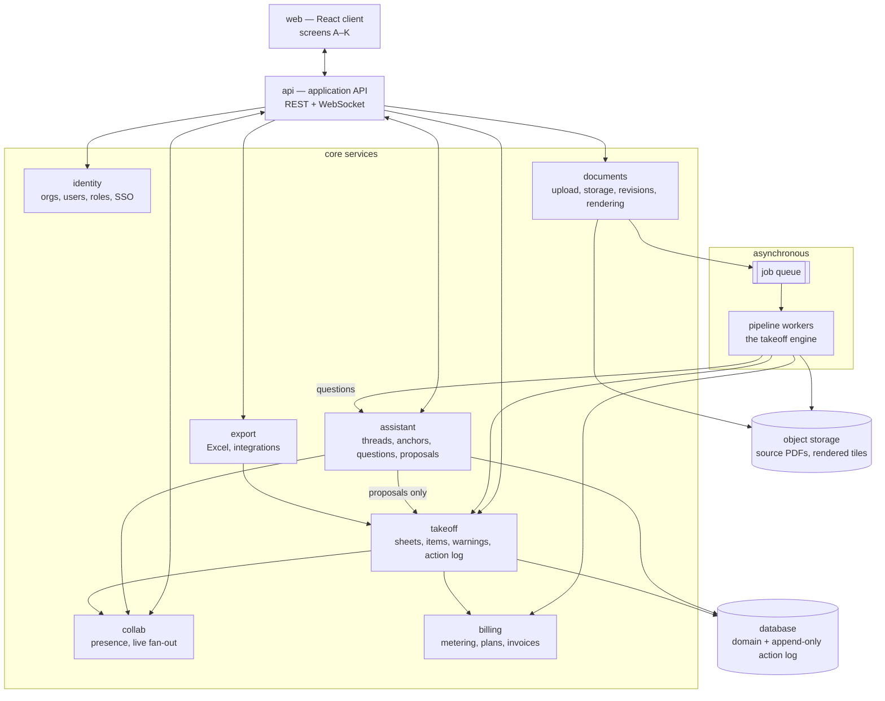

# Roadmap

What exists today is screen F of eleven, built as a client-only prototype. This document covers the distance between that and a product a stranger can pay for.

It is organized as **three tracks** rather than a single ordered list, because the tracks are worked in parallel by different people and the second one is longer than the first. A flat list makes the remaining work look like "five more screens," which is the wrong picture.

| Track | What it covers | State |
|---|---|---|
| 1 — Product surface | The eleven screens and the interactions between them | 1 of 11 built |
| 2 — Platform | Ingestion, the takeoff engine, storage, identity, collaboration, export | Not started |
| 3 — Commercial readiness | Billing, compliance, support, contracts, SLA | Not started |

Sequencing across tracks is in [`BUILD-STAGES.md`](BUILD-STAGES.md). This document is the inventory; that one is the order.

---

## Where we are

Screen F runs end to end against seed data. It has the status vocabulary, the warning schema, undo/redo with compound actions, presence, and bidirectional selection state. Everything it does is in the browser: `localStorage` is the database, `BroadcastChannel` is the realtime layer, the blueprint is drawn SVG, and the twelve takeoff items in [`src/lib/data.js`](src/lib/data.js) are hand-written.

The prototype's real output is not code — it is a settled data model and a settled interaction contract. Both carry forward. Most of the client code does too. None of the infrastructure does.

---

## Track 1 — Product surface

### Next

- **Screen G — takeoff table.** Same data reshaped. Bidirectional selection already lives in shared state, so this is table mechanics: grouping, column visibility, resize, sort, and bulk approval restricted to *Ready to review*.
- **Screens C, D, E — upload, confirm detected drawings, processing status.** These are the intake path and they gate every real document entering the system. Their states (partial success, unsupported document, password-protected, duplicate) are where the ingestion pipeline surfaces itself, so they cannot be designed independently of Track 2.
- **Screens A, B — projects dashboard and create project.** Familiar patterns once tenancy exists.

### After that

- **Screen H — export preview.** Must reconcile exactly with the drawer totals. See the totals invariant below — this is an architecture constraint, not a display concern.
- **Revision conflict flow** (spec path 4). Blocked on the product decisions listed at the end of this document.
- **Screen I — accuracy comparison.** Blocked on a benchmark corpus existing at all.
- **Screens J, K — company and project settings.** Every override needs "restore company default," which means settings need a resolution chain (company default → project override → sheet override) before the screens can be drawn.

### Cross-screen work the screen list hides

- **The conversation panel** — present on every screen, anchored to whatever the estimator is looking at. Design work spans C, D, E, F, and G rather than belonging to any one of them. Rules and architecture in [2.6](#26-the-conversation-layer).
- **Contextual help panels** (spec §6 requires them; nothing exists)
- **The full set of required states** from spec §10 — offline, permission denied, export failure, and connection-interrupted have no design yet
- **Notifications** — processing complete, a teammate approved your sheet, an addendum landed
- **Keyboard shortcut reference and a real focus-management pass** across screens that don't exist yet
- **Empty, loading, and error states for every new screen**, not retrofitted

---

## Track 2 — Platform

Nothing in this track exists. It is the majority of the engineering.

### 2.1 The takeoff engine

The single largest omission from the previous version of this document. The README lists "no takeoff is actually computed" as a limitation, which undersells it: this is the product. Everything else is chrome around it.

- **PDF ingestion** — vector-native drawings and scanned raster drawings behave completely differently and need separate paths. Assume both, in the same set. Sets arrive in three tiers, and the tier decides the method: vector with reusable symbol definitions, vector with exploded geometry, and raster. See [`docs/mvp-approach.md`](docs/mvp-approach.md) §1.
- **Page rendering and tiling** so the client never fetches a 300 MB file
- **Sheet classification and title-block parsing** — sheet number, title, discipline, revision, date, scale
- **Legend and schedule extraction** — the conflict flow in the prototype depends on an E0.1 luminaire schedule existing as structured data, not as a picture
- **Scale detection**, including sheets with two scale labels (the E2.1 case) and sheets with none (the E1.1 case)
- **Symbol detection** — the **Counting** agent. A geometry problem rather than a vision one: on a vector sheet the placements and their coordinates are in the file; extract them, do not estimate them. A marker whose position came from a model's guess sits slightly off the symbol, and one visibly wrong marker costs the estimator's trust in every other marker on the page. Counting emits an *unlabelled cluster* — 47 identical shapes at 47 coordinates — and does not know what any of them are. It is tested against known counts, never tuned.
- **Symbol classification** — the **Classification** agent, and this one *is* a language problem: reading the legend, matching a plan tag to a schedule row, normalizing a source description into a catalog item. It labels the cluster Counting produced, which is why one correction resolves every instance. Keep the two separated: geometry finds and counts, models interpret. Full boundaries in [`docs/superpowers/specs/2026-08-18-bidmate-agent-architecture-design.md`](docs/superpowers/specs/2026-08-18-bidmate-agent-architecture-design.md) §2.
- **Conduit and homerun measurement**, which is only partly extractable. The drawing shows a homerun arrow, not a route — the run length is an estimator's judgment from ceiling height and building geometry, and it is not in the file for anyone to read. Produce a length where the geometry supports one; elsewhere ask, carrying the firm's own feet-per-device rule as the starting point. Wire and conduit are a large share of material cost, so this is the largest single threat to a defensible total.
- **Item normalization** — a shared Division 26 taxonomy so "20A duplex receptacle" means one thing across every customer and every drawing set. This catalog is a long-lived asset and needs an owner.
- **An extensible taxonomy.** Healthcare, industrial, education, and multifamily sets carry items a warehouse never does — isolated power panels, nurse call, patient headwalls, gear at fault currents that change the item entirely. The catalog has to absorb new item classes without a schema migration, because the pilot will produce them weekly.
- **A per-firm symbol library.** Drafting conventions vary by architect, by GC, and by region. When an estimator classifies an unfamiliar symbol once, that resolution should apply to the rest of the set immediately and to that firm's future sets by default. This is the compounding asset in the product and the main reason breadth is affordable — see [2.6](#26-the-conversation-layer) for how the resolution gets captured.
- **Warning generation** that satisfies the four-field schema. A warning missing `found`, `why`, `fix`, or `where` is a schema error, so the pipeline must be able to produce all four or produce nothing.
- **Confidence handling that never reaches the interface.** The pipeline needs internal scores to decide *Ready to review* vs *Needs attention*; the estimator never sees a number. That translation happens server-side, once.
- **Per-sheet coverage outcomes.** On a set the engine reads poorly, the honest result is a sheet marked as unreadable with a reason, not a sheet with six items on it and no indication that forty were missed. Silence reads as completeness, and an estimator who trusts a silently incomplete sheet is the worst outcome the product can produce.

### 2.2 Document handling

- Object storage with tenant-scoped keys and a retention policy
- Resumable multipart upload — full drawing sets run 100–500 MB
- Malware scanning and **parser sandboxing**; PDF parsers are a well-known remote-code-execution surface and this system runs untrusted files from the internet through them
- Password-protected and corrupt-file handling with recovery copy
- Revision sets: which sheets are active, which are superseded, what an addendum does to work already in progress
- **Document deduplication policy — decide before writing storage.** See open decisions.

### 2.3 Identity, tenancy, permissions

- Org → project → user hierarchy, enforced at the data layer rather than in query filters
- Email/password for small shops; SAML and SCIM for enterprise contractors
- Invitations, deprovisioning, session management, MFA
- **A role model with approval authority as its center.** The entire status vocabulary rests on "a person confirmed it." Today that person is an anonymous colored avatar invented on first use by [`identity()`](src/lib/store/local-transport.js:87). In production, whether an estimator can approve, whether a chief estimator must counter-approve, and whether a GC guest can see anything are the questions that make the audit trail meaningful.
- External/guest access with read-only scope

### 2.4 Data and domain services

- Real database, migrations, backups, and a **restore that has actually been tested**
- The takeoff store: projects, revision sets, sheets, items, warnings, evidence links, notes
- **The action log.** [`commitAction`](src/lib/store/seed.js:146) already commits every mutation as `{ kind, before, after, by, at, label }`. Persist that shape append-only and it becomes the audit trail, the undo stack, and the compliance record at once. Do not let it become a mutable table.
- Server-side rule enforcement (see invariants)
- Totals computation in exactly one place

### 2.5 Processing infrastructure

- Job queue with retries, dead-letter handling, and per-sheet partial success — screen E's partial-failure states are a contract with this queue
- **Prioritization by bid date.** Bid deadlines are hard deadlines. An estimator whose sheets sit behind a competitor's 400-sheet hospital set at 4pm the day before a bid has already churned.
- Backpressure and per-tenant concurrency limits
- Reprocessing: a single sheet, a revision delta, or a whole set after an engine improvement

### 2.6 The conversation layer

A persistent panel on every screen, carrying traffic in both directions: the estimator supplies context the drawings don't contain, and the system asks about things it could not resolve on its own. On the review workspace it is anchored to the canvas, so "this one" and "these" have referents.

This is what makes broad building coverage viable at MVP. An engine that meets an unfamiliar symbol on a hospital set has two options — guess, or ask. Asking is the only one compatible with an estimator's reputation riding on the number.

**The constraint that keeps it from breaking the spec.** Spec §12 forbids a critical workflow depending on a chat interface, and it is right to. So:

- **Chat is an input channel, never the only one.** Anything sayable in chat is doable through a form, a field, or a menu. An estimator who never opens the panel can complete a full review.
- **Everything captured lands in the structured model.** A fact given in conversation becomes an item field, a symbol library entry, a project context record, or a warning resolution — visible and editable in the normal interface. Chat is not a store; it is a way to write to the store.
- **Every question is also answerable elsewhere.** A question about an unclassified symbol is the same *Needs attention* item that already sits in the review queue, surfaced conversationally. It is not a second inbox competing with the first.
- **The assistant never approves.** It can propose classifications, quantities, and scale; a person confirms every one. Approval is the legal firewall and the one act that cannot be delegated.

**The panel is a surface over the Conversation agent, and that agent routes rather than answers.** An anchor tells you what the estimator pointed at, not what they meant — "ignore this wing, it's existing to remain" is a scope exclusion, "ceiling's 14 feet in here" feeds measuring, "we're not doing site lighting" touches the project record and several sheets at once. Resolving intent, referents, and domain is real interpretation and gets its own boundary. But it hands the actual work to the owning agent: given "these six are all type F," Conversation resolves *which six* and *which field*, then Classification produces the label. It never classifies itself. Two paths to a classification means two classifiers, and when they drift every per-agent accuracy number stops meaning anything.

**What gets built**

- Conversation service with threads scoped to project, sheet, and item, and shared across the reviewers on a project
- **Anchored messages.** A message can carry `{ sheetId, x, y }`, a region, or an `itemId`, in the same 1000 × 750 sheet coordinate space the markers already use. Clicking a message flies the canvas to its anchor; clicking a marker filters the thread to it.
- **Point-and-tell on the canvas.** Drop a pin or drag a region and describe what is there — "these six are all type F," "everything in this wing is emergency power," "ignore this area, it's existing to remain." A region plus a sentence is dramatically faster than editing twelve items.
- **Proposals, not edits.** An answer produces a preview of what would change, with counts. The estimator applies it, and application flows through the existing `commit()` path as one undoable action attributed to them, with the conversation as provenance. Undo, audit, sync, and toast behavior all work unchanged because nothing new was invented.
- **Project context capture** at intake — the GC, the drafting conventions, what's in scope for this bid, which sheets to ignore. This is the highest-value context in the system and the cheapest to collect, and it belongs on screens C and D, before processing, not after.
- Question generation from pipeline gaps, ranked, with the same four-field discipline warnings use: what was found, why it matters, what is being asked, where the evidence is
- Firm-level memory, so a resolution given once is not asked again next month

**Language rules.** The panel follows the same product language as everything else: no model names, no confidence numbers, no "I think," no processing internals, sentence case, plain construction terms. It reads as a knowledgeable colleague asking a specific question about a specific detail, not as an assistant. The domain already has a name for a question about ambiguous drawings — an RFI — and the copy should borrow that register even if the term itself is reserved for questions that actually go to the architect.

**Security.** Text extracted from an uploaded PDF is untrusted input. If a conversation can produce proposals that change quantities, then drawing content reaching that conversation is an injection surface — a set could contain text crafted to steer classification. Extracted document text must be handled as data, never as instruction, and proposals must be constrained to the item schema rather than to arbitrary actions. This is a design requirement for the service, not a later hardening pass.

### 2.7 Collaboration

Replaces the seed store's local transport, [`local-transport.js`](src/lib/store/local-transport.js), entirely.

- WebSocket fan-out for item changes, presence, and remote selection
- Reconnect, replay, and offline behavior
- **The shared undo model**, still an open decision (below). Whatever is chosen has to survive a real network, which the current linear stack does not.

### 2.8 Export and integrations

- Excel generation that reconciles exactly with approved totals, including source sheet references
- **Spreadsheet import at project start.** Estimators already keep their takeoff in Excel; letting them bring it in means value on day one without trusting the engine first. Imported rows carry their own provenance — the evidence is a person's judgment, not a sheet — and are honest about it rather than borrowing the credibility of a drawing-linked row. Import at the **start** of a project is onboarding; re-import **after** review would overwrite the audit trail and is a different, worse feature. Doubles as the benchmark corpus, see [3.4](#34-go-to-market-foundations).
- **Export into the tools estimators already use** — Accubid, ConEst, McCormick, Trimble. Excel is table stakes; landing directly in their pricing database is what displaces the incumbent workflow.
- Document sources — Procore, BuildingConnected, SmartBid, Dropbox, Box. Estimators receive bid invitations there, and manual re-upload is friction at exactly the wrong moment.
- A versioned public API and webhooks

### 2.9 Operations

- Environments, infrastructure as code, secrets management
- CI that runs tests — there are currently **no tests of any kind**, and the only workflow is [`deploy.yml`](.github/workflows/deploy.yml) publishing to Pages
- Error tracking, structured logs, metrics, alerting, on-call, incident process
- Public status page. Bid-week downtime is a different severity of event here than in most B2B software.
- **Back-office tooling.** Support cannot help with a stuck sheet without seeing the project. Impersonation needs to be explicit, scoped, and written to the same audit log.
- Product telemetry — where review time actually goes, which warnings get overridden, which symbols keep coming back unclassified. This feeds the engine roadmap and nothing else generates it.

---

## Track 3 — Commercial readiness

### 3.1 Billing

- **Metering first.** Processing costs real money per sheet, so flat per-seat pricing inverts on heavy users. Usage events are the one thing that cannot be retrofitted into a schema later — emit them from the first paid sheet.
- Plans, trials, upgrade/downgrade, proration, dunning
- **Construction billing reality**: many contractors will not put a subscription on a card. Expect annual contracts, purchase orders, ACH, and invoicing. Stripe Checkout alone does not cover this market.
- Usage limits and honest overage behavior — decide now what happens when a firm hits a cap mid-bid, because cutting them off at 4pm Tuesday ends the relationship
- Tax, revenue recognition, refunds

### 3.2 Security and compliance

- Encryption at rest and in transit, documented key management
- Dependency policy, vulnerability scanning, external penetration test
- **SOC 2 Type II.** Mid-size and enterprise contractors will ask. The audit wants 6–12 months of evidence, so instrument controls long before starting the process.
- Immutable, exportable audit log — the firm's defense when a bid goes wrong
- Data residency questions from larger customers
- Incident response and breach notification procedures

### 3.3 Legal and risk

- Terms that disclaim reliance. **The "estimator approved" gate is the legal firewall** — the status vocabulary is a liability structure as much as an interaction one, which is why nothing counts without a person approving it.
- Errors-and-omissions insurance
- DPA, subprocessor list, privacy policy
- Customer data ownership, export on cancellation, deletion on request (GDPR/CCPA, and contractors who simply want their drawings back)
- **Bid confidentiality obligations.** Drawing sets frequently arrive under NDA from a general contractor. The terms need to say what the platform does with them.

### 3.4 Go-to-market foundations

- Onboarding that works without a call, eventually
- Documentation, in-product help, support tooling and SLA
- **A benchmark corpus.** Screen I compares against an "estimator-approved reference," and that reference is an ongoing data operation — labeled drawing sets across building types — not a screen. Without it, accuracy claims are unsupportable and the screen cannot ship. **Spreadsheet import is the cheapest way to build it**: a firm's finished takeoff plus the drawings it came from is a graded answer key, produced as a side effect of onboarding rather than as a data operation. Subject to the bid confidentiality obligations in [3.3](#33-legal-and-risk) — an NDA'd set does not become training data because it arrived through an import button.

---

## How the parts fit together

### Service map

The client talks only to `api`. Everything else is reachable only through it, which is what makes the invariants below enforceable rather than aspirational.

### Critical flows

**Ingest — upload to review-ready.**
`web` uploads to `documents` (multipart, direct to storage with a signed URL). `documents` scans the file, classifies it, records a revision set, and enqueues one job per sheet. `pipeline` workers render tiles back to storage and write sheets, items, and warnings into `takeoff`. Each sheet completing emits a progress event through `collab` so screen E updates without polling, and a metering event to `billing`. **A failed sheet fails alone** — completed sheets stay visible and reviewable, per spec §5 screen E.

**Approve an item.**
`web` posts an approval. `api` checks the actor's role in `identity`, then `takeoff` validates the transition — and this is the part that matters: **the rule that a *Missing information* item cannot be approved is enforced here, not in the browser.** The client also enforces it, for immediate feedback with the evidence on screen, but the client is a convenience. `takeoff` appends the action to the log, updates the item, and publishes through `collab` to every other reviewer in the project. Drawer totals are recomputed from the same query the export uses.

**Confirm a scale.**
One request, one transaction, one audit entry. `takeoff` updates the sheet's scale and re-derives every measured item that was blocked by it, exactly as [`setScale`](src/lib/store/seed-scale.js:30) does today. The undo of that action reverses both halves together. An estimator who confirms a scale and immediately regrets it gets one undo, not fourteen.

**Supply context through the conversation panel.**
The estimator drags a region on the canvas and says the fixtures inside it are type F. `web` sends the message with its anchor to `assistant`, which resolves the region against `takeoff` to a concrete set of item ids and returns a **proposal** — nine items, current classification, proposed classification. Nothing has changed yet. The estimator applies it; `api` routes that to `takeoff` as an ordinary edit action carrying the thread as provenance, and it lands in the action log, the drawer totals, the undo stack, and every other reviewer's screen through `collab` by exactly the path a manual edit takes. If the resolution was a symbol classification, it also writes to the firm's symbol library, and the remaining unclassified instances on the set stop being questions.

**Finish review and export.**
`export` reads approved items from `takeoff` through the same totals query that feeds the bottom drawer and screen H. Blocking is evaluated server-side: *Missing information* items block with no override; *Needs attention* items require a recorded acknowledgment, and the acknowledgment itself is an entry in the action log with a name and timestamp on it.

**An addendum arrives mid-review.**
`documents` recognizes the set as a revision of an existing one and enqueues only the changed sheets. `takeoff` marks superseded sheets, which immediately removes them from every totals query. `collab` has to tell a reviewer who is *currently looking at a sheet that just became superseded* — an interaction that does not exist yet and is one of the open decisions below.

### Invariants that cross service boundaries

These are the rules that break silently when a new service is added by someone who has not read `CLAUDE.md`. They belong in integration tests, not in prose.

1. **Totals are computed in exactly one place.** The bottom drawer, screen G, screen H, and the Excel file must never contain four implementations of the same sum. One query, four consumers.
2. **Superseded sheets never contribute to totals.** Enforced inside that query, not by callers remembering to filter.
3. **Layer toggles are client-only.** Visibility never travels to the server and never touches a total. An estimator reducing clutter must not change the number they are about to bid.
4. **Approval rules are server-authoritative.** *Missing information* blocks approval; bulk approval accepts only *Ready to review*. The client enforces both for good feedback; the server enforces both for correctness.
5. **The warning schema is validated at the API boundary.** Four fields or the write is rejected. This is why the pipeline cannot emit a partial warning under load.
6. **The action log is append-only.** Undo writes a new compensating action; it never deletes history.
7. **Processing internals stop at the API boundary.** Confidence scores, model identifiers, and pipeline stage names are used for routing and never serialized into a client response. The status vocabulary is the only thing that crosses.
8. **Every mutation is attributable.** `by` and `at` on every action, including actions taken by support staff while impersonating.
9. **The conversation layer proposes; it never writes.** Every change it produces goes through the same action path as a manual edit, attributed to the person who applied it. There is no code path from a message to a quantity that skips a human.
10. **No workflow requires the panel.** Anything sayable in conversation is doable through the structured interface, and every question raised there also exists in the review queue. This is testable: a full review completed with the panel closed must reach the same end state.
11. **Extracted document text is data, never instruction.** Content lifted from an uploaded PDF must not be able to steer a proposal, and proposals are constrained to the item schema rather than to arbitrary actions.
12. **Agents hand off typed records, never prose.** No agent reads another agent's reasoning. Passing context forward compounds errors invisibly — one agent hedges, the next inherits the hedge as fact — and it invalidates every downstream eval set whenever an upstream agent changes, which makes per-agent measurement impossible. A typed record also enforces invariant 11 by shape rather than by vigilance.
13. **The agents stop at total direct cost.** Markup, overhead, profit, bond, and tax are an estimator-owned layer. No agent proposes a markup number, for the same reason none of them approves: the spread between cost and bid is the judgment a contractor is legally bound by.

### What the prototype maps to

| Prototype | Production |
|---|---|
| `localStorage` via `seed.js` and `local-transport.js` | database behind `takeoff`, read through `api` |
| `BroadcastChannel` | WebSocket fan-out in `collab` |
| `identity()` random name and color | `identity` service with roles and approval authority |
| `hist.undo` array capped at 60 | append-only action log, undo as compensating actions |
| `ITEMS` seed array | `pipeline` output written to `takeoff` |
| Drawn SVG in `PlanDrawing.jsx` | rendered tiles from `documents`, markers layered over `pdf.js` |
| Client-side status filtering | same client code, server-authoritative rules underneath |

The client-side interaction model does not change. That is the point of having built it first.

---

## Decisions to make before building

Two of these are cheap now and expensive later. Both should be settled before the first schema is written.

- **Cross-tenant document isolation.** Two electrical subs may bid the same job and upload the same drawing set. Content-addressed deduplication across tenants would leak the fact that a competitor is bidding — a storage optimization that looks free and is a customer-losing incident. Decide the policy before writing storage.
- **Usage metering in the schema.** Whether pricing ends up per seat, per project, per sheet, or hybrid, the events must be emitted from the start. Reconstructing usage history after the fact is not possible.

Carried forward from earlier drafts, still open:

- **The shared undo model.** The stack is currently shared and linear, so person B can undo person A's approval. Alternatives are per-user stacks with a merge policy, or a CRDT. Needs a product call, and now also needs to work over a real network.
- **Revision conflict flow.** Whether superseded sheets stay browsable read-only, whether approvals carry forward across a revision, and how a mid-review swap surfaces to a second reviewer already in the file.
- **Approval authority.** Whether any estimator can approve, or whether a project can require a second approver. This shapes the role model, the audit log, and the finish-review gate.
- **What happens at a usage cap mid-bid.** A hard stop is defensible policy and indefensible timing.

Raised by the conversation layer:

- **The doctrine conflict is real and needs a written call.** Spec §1 says "not a chat interface," §6 says contextual help panels rather than chat popups, §12 makes it an acceptance criterion, and `CLAUDE.md` says never surface AI framing in the product. A conversational panel is compatible with the *intent* of all four — none of them were guarding against an estimator being able to tell the system something, they were guarding against chat becoming the product's front door. But the documents currently say something stricter than that, and leaving the contradiction unresolved means the next person to read them builds the wrong thing. Amend the spec and `CLAUDE.md` to state the additive constraint explicitly, or drop the feature.
- **Shared thread or per-user thread.** Context that person A supplies should benefit person B — that is most of the value. But two reviewers answering the same question differently, in the same thread, needs a resolution policy. Presence already exists to make this visible; the policy does not.
- **Whether firm memory applies to new projects automatically.** A symbol resolved once and reused silently is the compounding asset. A symbol resolved *wrongly* once and reused silently is a systematic error propagating across every future bid, which is worse than the original problem. Likely answer is that firm-level defaults surface as *Ready to review* rather than pre-approved, but it needs deciding before the library is built.
- **Whether a question is a distinct record or a view of an existing one.** An unclassified symbol is already a *Needs attention* item. If questions become their own type, there are two queues to keep in sync and a fifth status will be invented within a month. Preference is strongly for questions being a rendering of existing items and warnings, with only project-level questions that belong to no item stored separately.
